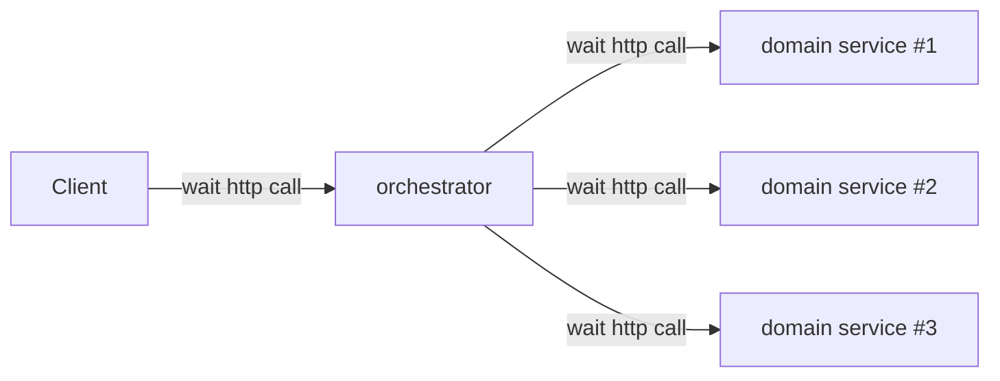

# Epic Saga

## General

```mermaid
flowchart LR

C["Client"]-->|wait http call|O["orchestrator"]
O-->|wait http call|D1["domain service #1"]
O-->|wait http call|D2["domain service #2"]
O-->|wait http call|D3["domain service #3"]
```
